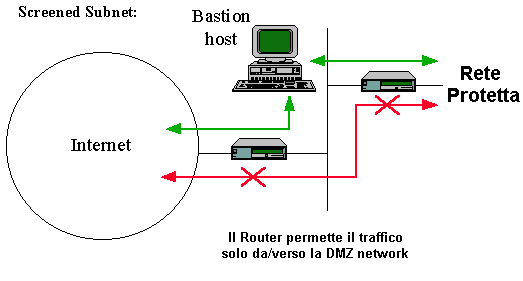
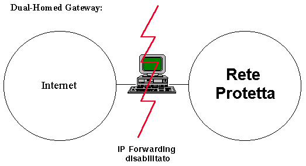
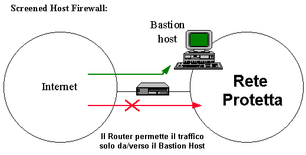
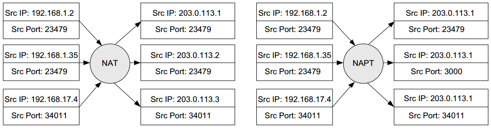
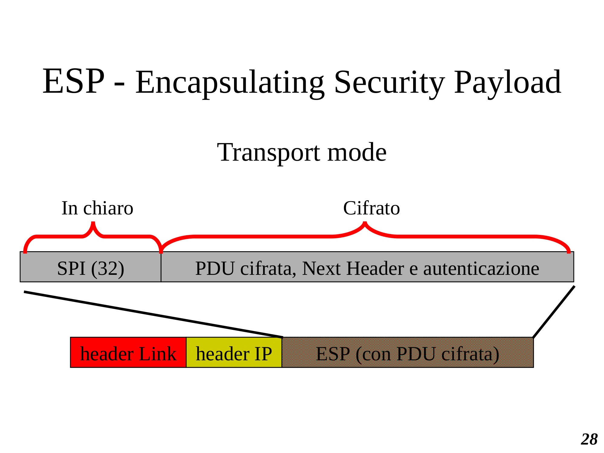
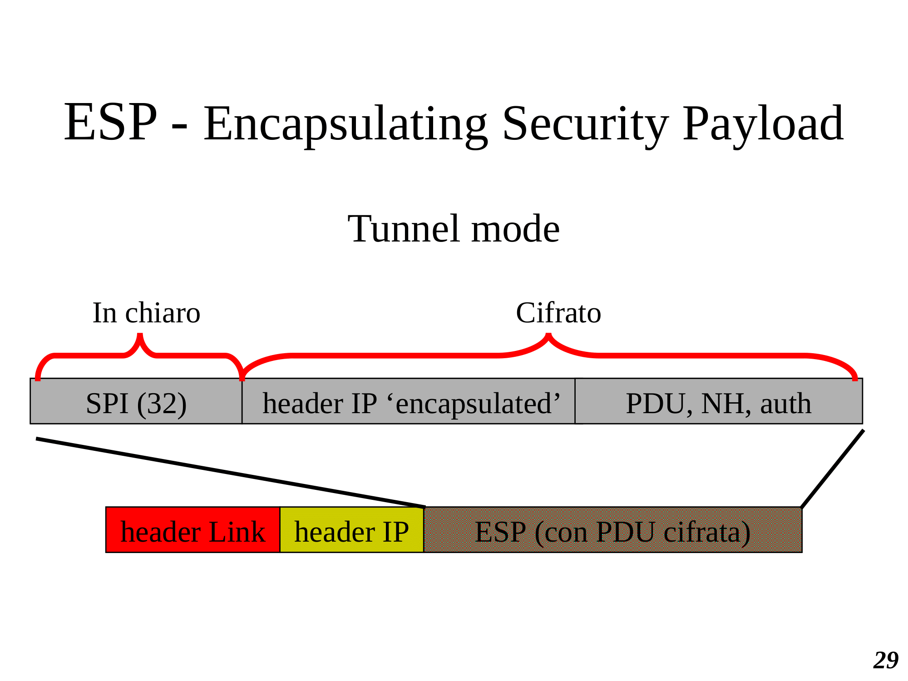

# CIFRARI

Il **CIFRARIO** è un sistema che permette di:

- Cifrare
- Decifrare
- Generare e Gestire chiavi crittografiche.

Può essere:

- Aperto
- Chiuso

Definizioni

- **Plaintext** - testo prima della encryption
- **Ciphertext** - testo dopo l'encryption

## SIMMETRICI (chiavi condivise)

Caratteristiche:
- Mittente e Ricevente hanno la stessa chiave K
- Cifratura e decifratura sono efficienti
- Difficilissimo decifrare senza conoscere la chiave (essendo l'informazione necessaria)

#### Cifrari 'pre-informatici':

- **Character-oriented**
  - **Cifrario di Cesare**
    - monoalfabetici a 1 lettera
  - **Cifrario di Playfair** (monoalfabetico a 2 lettere)
  - **Cifrario di Vigenere** (polialfabetico)
- **Bit-oriented**
  - Cifrario di Vernam e one-time pad
- **A Sostituzione** - un gruppo di caratteri viene sostituito con un altro gruppo di caratteri
- **A Permutazione** - gruppi di caratteri vengono spostati nel testo
- Cifrari *monoalfabetici* a $N$ lettere - Ogni $N$-upla di lettere del testo viene sostituita sempre dalla stessa sequenza di lettere
- Cifrari *polialfabetici* - Una lettere o $N$-upla di lettere può essere **cifrata diversamente** a seconda della sua posizione nel testo

##### Cifrari monoalfabetici a 1 lettera

Come il cifrario di **Cesare**, ma la chiave $K$ identifica una sostituzione per ciascuna lettera (es. a-q, b-q, c-f,...):
*abcdefghilmnopqrstuvz*
*qzfabdeohilmnprstcugv*
**Esistono $N!$ diverse chiavi per $N$ lettere.**
- Non si può provare a decifrare manualmente (brute force) tutte le possibili chiavi (come in **Cesare**)
- Molto deboli a causa di *regolarità* statistiche 
  - **Crittanalisi Statistica** che considera la frequenza delle lettere del testo con la frequenza delle lettere in un linguaggio
  
##### Cifrari monoalfabetici a $N$ lettere

Ogni sequenza di $N$ lettere viene sostituita con una sequenza fissata di $N$ lettere. Per esempio (aa-qe, ab-zi, ba-df, ...)
- Migliore di $N=1$ (a una lettera)
- Rimane possibile **Crittanalisi statistica** (più il testo è lungo e più facile sarà)

##### Cifrario di Playfair (monoalfabetico $N=2$)

- Rimane possibile *Crittanalsi statistica*

##### Cifrari Polialfabetici

## ASIMMETRICI (chiavi diversi per cifratore e decifratore)

\pagebreak

# FIREWALL

I Firewall vengono realizzati perche, in una rete, configurare e aggiornare ogni singolo computer e impossibile.
Mantenere, invece, un singolo punto di controllo e piu facile. Quindi vengono usati per filtrare il traffico e proteggere i computer della rete.

- il FW d l’ i il FW deve essere l’unico
punto di contatto della rete
interna con quella esterna
- solo il traffico “autorizzato”
può attraversare il FW
- il FW deve essere un sistema
altamente sicuro esso stesso

**Funzionalità:**

1. Filtri sulla base di:
   - Destinazione
   - Servizi
   - Utente
2. Log di:
   - traffico complessivo
   - azioni dei singoli utenti
3. Generazione di allarmi

**Tipi di configurazione:**

1. **Screening Router**
   - uso del router per filtrare il traffico sia livello IP che superiore
   - non richiede hardware dedicato
   - non necessita di proxy (quindi di modifiche agli applicativi) 
   - insicuro
   - 
2. **Dual-homed gateway**
   - Facile realizzazione
   - richiede poco hardware (il SW firewall su PC o Calcolatore Custom0)
   - possibile mascherare la rete interna
   - scarsamente flessibile
   - grosso sovraccarico di lavoro
  

3. **Screened host gateway**
   - servizi forniti da un calcolatre (bastion host) con funzione di application gateway
   - separazione della rete interna viene realizzata dal router
   - router filtra i pacchetti in maniera tale che solo il bastion host possa aprire connessioni con la rete esterna.
   - tutti i sistemi esterni che desiderino collegarsi con la rete privata possono connettersi solo con il bastion host
   - Eccezioni: protocolli abilitati direttamente

4. **Screened subnet**
   - firewall viene realizzato utilizzando due router che creano una rete, compresa tra loro, detta rete perimetrale, su cui si trovano le macchine (bastion host) 
   - **bastion host** forniscono i servizi (ad esempio l’application gateway e il server di posta elettronica) 
   - router esterno filtra il traffico tra Internet e la rete perimetrale (in accordo con la politica di accesso ai servizi stabilita per la rete)
   - il router interno protegge la rete privata sia da Internet che della rete perimetrale consentendo esclusivamente il transito di pacchetti da e verso i bastion host. 
   - E’ possibile configurare i due router in maniera tale da consentire il transito di traffico che si considera fidato tra Internet e la rete interna senza la mediazione di application gateway
  

  **Tipi di configurazione:**

  1. **Packet Filter:**
      - Filtra in base a:
        - Direzione del pacchetto
        - Direzione della connessione
        - Indirizzo IP (sorgente e destinazione)
        - Servizio (porta sorgente e destinazione)
      - Difficolta' con alcuni protocolli
      - Non mantiene log
      - Difficile monitorare attacchi mentre avvengono
      Un **problema** importante nella configurazione di un  firewall riguarda la **frammentazione IP**. Infatti  se un pacchetto viene frammentato in pezzi molto  piccoli, ogni parte può essere tanto ridotta da  non includere neanche l'header TCP e quindi la  porta utilizzata nel firewall per filtrare.    Questo succede per frammenti di poco più di 20  byte, che sono comunque ingiustificati rispetto  a qualsiasi MTU. Tali frammenti corti devono quindi essere tagliati.

Un'altra regola importante e' bloccare tutti i pacchetti con l'opzione di **source routing** perche' **permette IP spoofing** con TCP su WAN.

  1. **Application Proxy**
      - Connessioni dirette tra interno ed esterno sono **proibite** 
      - Possibili solo connessioni attraverso il firewall
      - Ogni servizio dev'essere configurato
      - Non trasparente
      - richiede host dedicato
      - Prestazioni medie
      - Sicuro
      - Mantiene log sofisticati
      - E' in grado di riferire il traffico agli utenti

**Attenzione! Il firewall non risolve tutto:**
- non evita il problema di password deboli
- non filtra traffico via modem
- non tratta attacchi dall’interno
- non evita problemi di sicurezza sui servizi e sui
protocolli aperti verso l’esterno
e, in generale,
- non protegge da virus o simile portato su
dischetto
- evitare il ‘denial of service’

**NAT** (Newtwork Address Translation)

**NAPT** (Networkd Adrress & Port Translation)

\pagebreak

# VPN (Virtual Private Network)

## **IPSec** (IP Level Security)
La **PDU** (Protocol Data Unit) trasportata dal pacchetto IP è:
- cifrata e/o (simmetricamente) (**ESP** - Encapsulating Security Payload)
- autenticata (simmetricamente) (**AH** - Authentication Header)

All'header vengono aggiunte informazioni che permettono al ricevente autorizzato di:
- decifrare e/o
- verificare integrità e autenticità

**Conseguenze:**
- Router vedono: indirizzo mittente e destinatario (come appaiono nell'header IP)
- Router non vedono PDU se cifrata
- Router non possono modificare i messaggi se autenticati (il ricevente se ne accorge)
- Reti aziendali protette da intercettazioni e modifiche su internet
- Cifratura e autenticazione gestite solo sulle LAN sorgente e destinazione
- IPSec non protegge da attacchi all'interno delle LAN private e servizi verso l'esterno (quelli senza cifratura/autenticazione a livello IP)

**Transport mode**
  Cifratura e autenticazione su **computer** mittente e destinatario
  - Protegge da Sniffing/Spoofing su rete locale
  - Rende visibili su internet indirizzi mittente e destinatario
  - Richiede speciale configurazione del computer utente (non trasparente)
  - Necessario per traffico da postazione mobile
**Tunnel mode**
  Cifratura e autenticazione su **firewall** o **router**
  - **Non protegge** da Sniffing/Spoofing su rete locale
  - Nasconde gli indirizzi dei singoli computer (mittente e destinatario) ma non gli indirizzi della rete mittente e destinataria
  - È trasparente all'utente singolo
  - Veloce, prodotti affidabili per router/firewall

**AH** (Authentication Header)
Serve per **autenticare** (**non** per nascondere indirizzi IP o evitare intercettazioni) il traffico IP, normalmente tra due LAN private per evitare modifiche o falsificazioni. Campi:
- Next Header ($8$) - Identifica il protocollo superiore in IPv4 (next header in IPv6)
- Length ($8$) - utile perché la lunghezza di Data varia a seconda dello SPI
- Reserved ($16$)
- SPI ($32$, Security Parameters Index) - Identifica un indice dell'algoritmo e delle chiavi crittografiche
- Data ($N \times 32$) - codici di autenticazione (MAC - Message Authentication Code) riferiti a tutto il pacchetto, ma dove i campi variabili (TTL, checksum) sono uguali a $0$

**ESP** (Encapsulating Security Payload)
Serve per **cifrare** il traffico e per **evitare intercettazioni**.

**IPSec anti-replay**

Allo stabilire di una nuova **SA** (Associazione di Sicurezza):
- Il **mittente** inizializza un contatore a 0 che incrementa ad ogni invio di un pacchetto (durante l'attuale SA).
Il numero massimo a cui arriva il contatore è $2^{32}-1$ e **non deve ricominciare**. Quando raggiunge il limite si crea una **nuova SA**.

- Il **Ricevitore** implementa una finestra $W$ (tipicamente $W=64$) con $N$ margine destro (contiene 00il numero, sequenziale, più elevato dei pacchetti ricevuti)

Ricezione pacchetti:

1. È nuovo e rientra nella finestra:
   1. controllo MAC
   2. si contrassegna la posizione
2. È nuovo e si trova a **destra** della $W$:
   1. controllo MAC
   2. fatta avanzare la finestra e si aggiorna il margine destro all'attuale *Sequence Number* (del pacchetto appena ricevuto)
3. Se si trova a **sinistra** o **fallisce MAC** viene scartato

4. Determinazione Chiavi e Algoritmo Crittografico?
   - Usando le **SPI**, indirizzo **IP mittente e destinatario** e una **tabella di associazione** presente sulle macchinte di mittente e ricevente

5. Come si installa una tabella di associazione e come si inizializzano le chiavi?
   - A mano, durante l'installazione di IPSec
6. Che algoritmi di cifratura e autenticazione vengono usati?
   - Algoritmi convenzionali (**simmetrici**) perché il procedimento dev'essere efficiente

**CONCLUSIONE** - IPSec:

1. Permette di avere la stessa sicurezza che avremmo con un'unica rete locale (VPN)
2. Permette anche traffico da e verso reti esterne (attraverso Firewall se necessario)
3. Non introduce ritardi significativi
4. Non richiede operazioni di riconfigurazione agli utenti (trasparenza) **se installato in TUNNEL MODE**

\pagebreak

# PRIVATENET SECURITY

Problemi su una LAN:
- Intrusioni di utenti non autorizzati. 
  **SI EVITA:**
   - Controlli di accesso su ogni calcolatore
   - Firewall (filtro pacchetti e/o proxy)
   - Limitare o evitare collegamenti esterni
   - Logging di sessioni interne/esterne a analisi manuale
   - Programmi di rilevamento delle intrusioni (intrusion detection)
- Virus e altri programmi critici per la sicurezza. 
  **SI EVITA:**
  - Proibire installazione di software da parte dell'utente
  - Antivirus
  - Inserire filtro antivirus sul firewall
  - Mantenere backup sistematico (eventuale disaster recovery)
- Sniffing - lettura pacchetti su rete
  - Possibile su LAN aziendale
  - Possibile su rete locale da dove su collega un utente autorizzato
  - Difficile con switch, ma possibile
  - Possibile, ma non comune, su rete geografica
  - **SI EVITA (su LAN):**
    - usando reti con Switch
    - Cifrare a livello applicativo
    - Cifrare a livello di trasporto
    - Cifrare a livello IP su ogni calcolatore
    - Routing livello 2, ARP **statico**, DHCP **statico**, rilevamento indirizzi hardware non validi per indirizzo IP
  - **SI EVITA (all'esterno):**
    - Cifrare a livello applicativo
    - Cifrare a livello di trasporto
    - Cifrare a livello IP su router o firewall
    - Impedire collegamento diretto da rete non controllata
- Spoofing (falsificazione indirizzi) su:
  - Indirizzi hardware su LAN
    - Possibile su segmento broadcast della rete locale
      - per **ricevere** agendo su *ARP* e configurando la scheda di rete in modalità promiscua
      - per **trasmettere** agendo su certi tipi di schede di rete, cambiano l'indirizzo mittente
      - Inutile su **rete geografica**
  - Indirizzi IP
    - Possibile su LAN anche con TCP
    - Possibile su rete geografica con UDP
    - Impossibile su WAN con TCP
  - Indirizzi simbolici (DNS)
    - Configurando i calcolatori con l'indicazione di un DNS server che è possibile controllare
    - Controllando il DNS server normalmente usato sulla LAN
  - URL (Web Spoofing)
    - Usando una URL credibile per certi contenuti e controllando il server per quella URL
    - Utilizzando una URL qualunque e agendo sui link presenti in pagine WEB visitate spesso. Quindi inserendo contenuti arbitrari per la URL che è possibile controllare
- Spamming, Flooding, DOS
  - DOS **SI EVITA:**
    - Difficile evitarlo, in generale
    - Raro, in generale
    - Per applicazioni particolari (allarmi, militari, servizi ad alta affidabilità) occorrono reti dedicate
  - ESEMPI
    - **SYN FLOODING** 
      Inizio connessioni TCP a ripetizione verso il calcolatore vittima senza completare l'handshake (possibile con indirizzo IP spoofed, visto che la connessine viene solo iniziata)
    - **ICMP echo request**
      Invio di un gran numero di **echo request** verso un calcolatore B (**reflector**), con un indirizzo **IP sorgente falsificato** e uguale a quello della vittima
      - **smurf attack** dove B è un broadcast di rete o sottorete. Il mittente ha indirizzo IP *spoofed* uguale all'indirizzo della vittima A, che si trova sulla stessa rete o sottorete. 
    - **Spamming con relay SMTP**
      Forma particolare di flooding, con uno scopo preciso: **usare mail server altrui per inviare posta in grandi quantità**
      **SI EVITA** configurando il mail server in modo adeguato.

\pagebreak

# BITCOIN

### One-way hash functions

Vengono usate le *funzioni hash* **collision-resistant** (One-Way). Cioè dal Valore $V$ determinato tramite la funzione di Hash $H$ applicata all'Informazione $I$, non è possibile risalire al contrario nella catena.

- $H(I)=V$
  $I \to H \to V$, ma **impossibile** (computazionalmente) il contrario.

Se $|V| = k$ sufficientemente grande un attacco ti **forza bruta** richiederebbe **$2^k$ computazioni**.

### Hash pointers & Hash chains

**Hash Pointer** è un **puntatore** a dove l'informazione è salvata. Insieme al puntatore salviamo l'**hash** di quell'informazione.

Con un *hash pointer* possiamo ricevere l'informazione e con il codice *hash* verifichiamo che l'informazione **non** sia cambiata, altrimenti l'*hash pointer* non sarà più valido.

Con gli *hash pointers* possiamo creare strutture dati come **Hash Chains**, **Merkle Tree** (Binary Tree con HASH), **Hash Tables**, ecc.

**Hash Chain** è una catena in cui ogni elemento **punta al suo predecessore**.
Ogni cambiamento dei dati causa un **invalid HASH Pointer** nell'elemento **successore**.
L'**HASH Chain** può essere usata per i **tamper-evident log** (tamper = manomettere).

Siccome la **manomissione** è impossibile, si potrebbe pensare di creare una **nuova catena**. 
Per evitare ciò si usa una **Signed Chain** in cui l'**hash pointer** è firmato:
 - dalla **$K^-$ (Chiave Privata)** 
 - e la sua validità è *verificata* tramite **$K^+$ (Chiave Pubblica)**.

### Public keys as identities ("addresses")

Per generare un'identità:
1. Si genera una coppia di chiavi <$K^+, K^-$>
2. Si pubblica $K^+$ o $H(K^+)$ in modo appropriato
3. Si inizia usando $K^-$ per firmare ogni informazione desiderata.

Osservazioni:
- Chiunque può generare quante identità desidera
- Nessun certificato, non necessita di terze parti
- Le identità definite come **chiavi pubbliche** possono essere anonime (chiamate **"addresses"** nel gergo bitcoin).

### Simple Bitcoin scenario

#### Bitcoins as signed data

Una nuova moneta generata dal valore $X$ è firmata da $C$ con la sua firma $K^-$ e la sua identità è verificata con la chiave pubblica $K^+$.

#### A simple, non-secure scenario

- Chiunque potrebbe generare una qualche moneta di un qualche valore
- La moneta è usata per pagare qualcuno firmando (con $K^-$) la transazione
- Il ricevente può usarla, a sua volta, per pagare qualcun altro

Può esserci, però, il **double spending** con cui un utente, paga doppiamente
# inserire immagine

#### A centrally managed currency

- La catena della transazioni è firmata da un'autorità centrale
- L'autorità centrale può essere la stessa (identità) che genera nuova moneta
- Tutti devono fidarsi di essa

### Conclusioni
- Bitcoins = dati firmati
- Payments = transazioni firmate
- Per prevenire la doppia-spesa è stata introdotta un'autorità centrale, che è anche responsabile dell'emissione di nuova moneta

\pagebreak

# Risk Management

## OWASP

### TOP 10

1. **Injection**
   L'Injection (SQL, OS, LDAP) avviene quando dei dati non attendibili vengono mandati ad un interprete come *comando* o *query*. Questi dati possono ingannare l'interprete per fargli eseguire azioni non desiderate o riuscire ad accedere ad informazioni senza averne l'autorizzazione.

2. **Broken Authentication and Session Management**
   Riguarda le applicazioni con funzioni relative all'autenticazione o session management che, spesso, sono malconfigurate consentendo agli aggressori di compromettere password, chiavi, token di sessione o sfruttare altre vulnerabilità per assumere l'identità di altri utenti.

3. **Cross-Site Scripting (XSS)**
   Vulnerabilità di tipo XSS avvengono quando un'applicazione prende dei dati non attendibili e li manda ad un web browser senza un'adeguata validazione. XSS consente agli attaccanti di eseguire degli **script** sul web browser della vittima che possono reindirizzare l'utente verso siti malevoli, cambiare il sito web visitato dall'utente o rubare i dati di sessione e utilizzarli.

4. **Insecure Direct Object References**
   Questo accade quando uno sviluppatore **epone** un riferimento ad un oggetto di un'implementazione interna (file, directory, database key), senza controllarne l'accesso o senza alcuna protezione, consentendo agli aggressori di manipolare questi riferimenti per accedere a dati non autorizzati.

5. **Security Misconfiguration**
   Malconfigurazioni della sicurezza riguardano le impostazioni di sicurezza (di app, framework, web server, database, ecc.) che non sono definite, implementate o costantemente aggiornate. Ma anche il software non aggiornato può dar luogo a problematiche di questo genere.

6. **Sensitive Data Exposure**
   L'esposizione di dati sensibili come dati della carta di credito, credenziali che possono essere rubate dagli aggressori e conducono a furti d'identità, frodi. Questi dati sensibili meritano un'attenzione maggiore e un'adeguata protezione come la crittografia, specialmente quando sono scambiati tramite web browser.

7. **Missing Function Level Access Control**
   Molte **web application** verificano il livello di accesso ad una funzione prima di renderla visibile nella UI, ma senza controllo lato server dove si accede ad ogni funzionalità. Se le richieste non sono verificate anche lato server, gli aggressori saranno in grado di falsificare le richieste per accedere alle funzionalità senza un'appropriata autorizzazione. Per esempio accedere all'admin page di un sito web modificando l'URL nella barra degli indirizzi (quindi senza passare tramite navigazione della UI della pagina).

8. **Cross-Site Request Forgery (CSRF)**
    Ne sono esposti i siti web dinamici quando sono progettati per ricevere richieste da un client senza meccanismi per controllare se la richiesta sia stata inviata intenzionalmente oppure no. Diversamente dal cross-site scripting (XSS), che sfrutta la fiducia di un utente in un particolare sito, il CSRF sfrutta la fiducia di un sito nel browser di un utente.
    Un attaccante fa in modo che un utente vittima invii involontariamente una richiesta HTTP dal suo browser al sistema web dove è attualmente autenticato. Il sistema, vulnerabile al CSRF, avendo la certezza che la richiesta provenga dall'utente già precedentemente autenticato la esegue senza sapere che in realtà dietro la richiesta si cela un'azione pensata dall'attaccante come ad esempio un trasferimento di fondi, un acquisto di un oggetto, una richiesta di dati o qualsiasi altra funzione offerta dall'applicazione vulnerabile. 

9.  **Using Components with Known Vulnerabilities**
   Riguarda Componenti (come librerie, framework, software) che spesso sono eseguiti con privilegi alti.
   Se vengono utilizzati componenti notoriamente vulnerabili, un aggressore può sfuttare queste vulnerabilità per diverse azioni malintezionate in modo molto più facilitato.
   
10. **Unvalidated Redirects and Forwards**
    Le web application spesso reindirizzano gli utenti verso altre pagine o siti web, usando dati non affidabili per determinarne l'indirizzo.
    Senza un'adeguata validazione, gli aggressori possono reindirizzare gli utenti verso siti contenenti malware o sistemi di phishing oppure possono utilizzare il reindirizzamento per accedere a pagine senza autorizzazione.